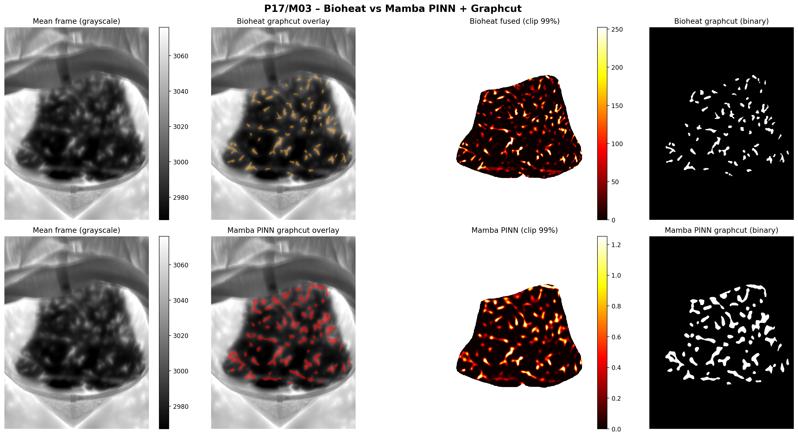
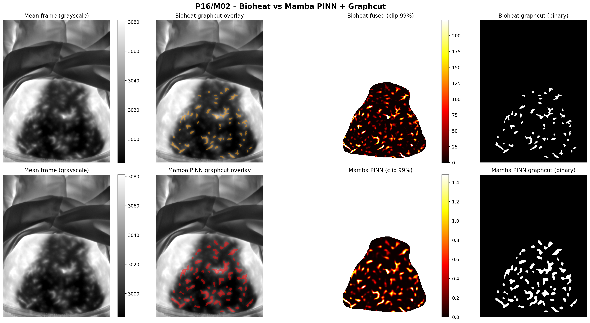
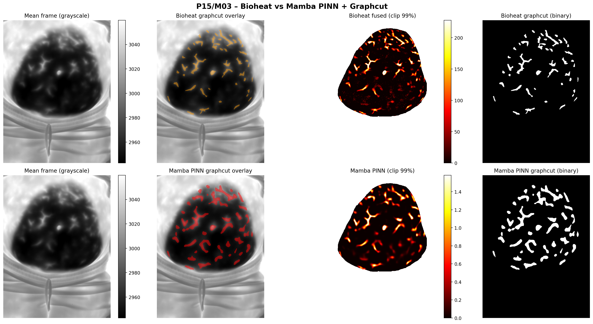

# mamba-bioheat-seg

**Mamba state-space models for thermal hotspot segmentation using physics-informed learning**

End-to-end deep learning framework for automatic hotspot segmentation in thermal imaging sequences. Combines Mamba state-space models with physics-informed bioheat constraints and graphcut refinement.

## Results

Comparison of traditional bioheat window fusion vs. Mamba-based prediction with graphcut segmentation:







## Install

```bash
pip install -e .
```

## Quick Start

### Training

Train the Mamba PINN model:

```bash
python -m bioheat_fusion_gpu.app task=train_mamba_pinn
```

### Inference

Run hotspot segmentation comparison:

```bash
python -m bioheat_fusion_gpu.app task=infer_bioheat_vs_mamba_graphcut \
  inference.mamba.model=/path/to/mamba_physics_informed.pth \
  inference.patients=[P02] \
  inference.measurements=[M02]
```

## Method

The framework consists of:

- **Mamba temporal modeling**: Efficiently processes 400+ frame thermal sequences using state-space models
- **Physics-informed loss**: Guided by the Pennes bioheat equation for physiologically plausible predictions
- **Graphcut segmentation**: Produces clean, anatomically-consistent hotspot boundaries

## Model Weights

Pretrained weights are available via [GitHub Releases](https://github.com/lienertdemaeyer/mamba-bioheat-seg/releases/tag/v1.0.0).

**Download:**
```bash
wget https://github.com/lienertdemaeyer/mamba-bioheat-seg/releases/download/v1.0.0/mamba_physics_informed_20251223_114254.pth -O weights/mamba_pinn.pth
```

**Load:**
```python
import torch
from bioheat_fusion_gpu.mamba_pinn_net import MambaPINNNet

model = MambaPINNNet(base_channels=32, d_state=16, n_mamba_layers=4)
ckpt = torch.load("weights/mamba_pinn.pth", map_location="cpu")
model.load_state_dict(ckpt["model_state_dict"])
```

## Package Structure

```
src/bioheat_fusion_gpu/
├── app.py                          # Hydra entrypoint
├── conf/                           # Hydra configs
├── train_mamba_physics_informed.py # Mamba PINN training
├── mamba_pinn_net.py               # MambaPINNNet model
├── mamba_blocks.py                 # Mamba building blocks (MambaBlock, SpatialEncoder, SpatialDecoder)
├── compare_bioheat_mamba_graphcut.py # Inference & visualization
├── bioheat_torch.py                # Bioheat equation (PyTorch)
├── graphcut.py                     # Graphcut segmentation
└── ...
```

## Citation

If you use this code in your research, please cite:

```bibtex
@software{mamba_bioheat_seg,
  author = {De Maeyer, Lienert},
  title = {Mamba-Bioheat-Seg: Thermal Hotspot Segmentation with State-Space Models},
  year = {2025},
  url = {https://github.com/lienertdemaeyer/mamba-bioheat-seg}
}
```

## License

MIT License
